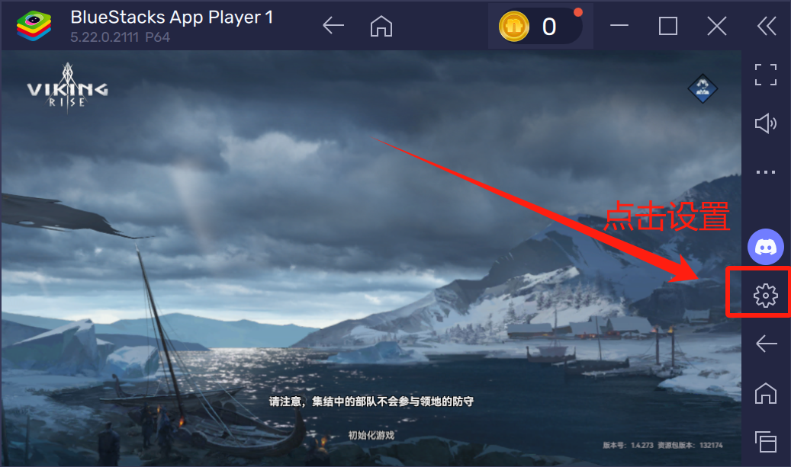
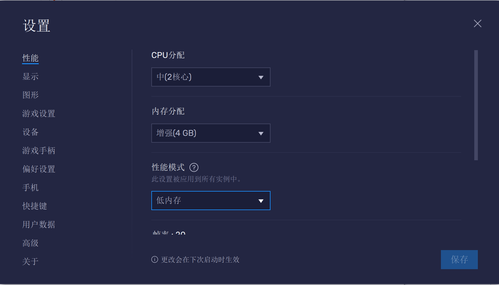
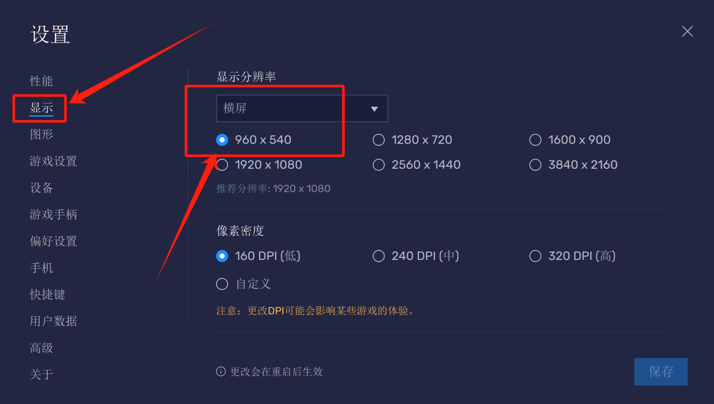
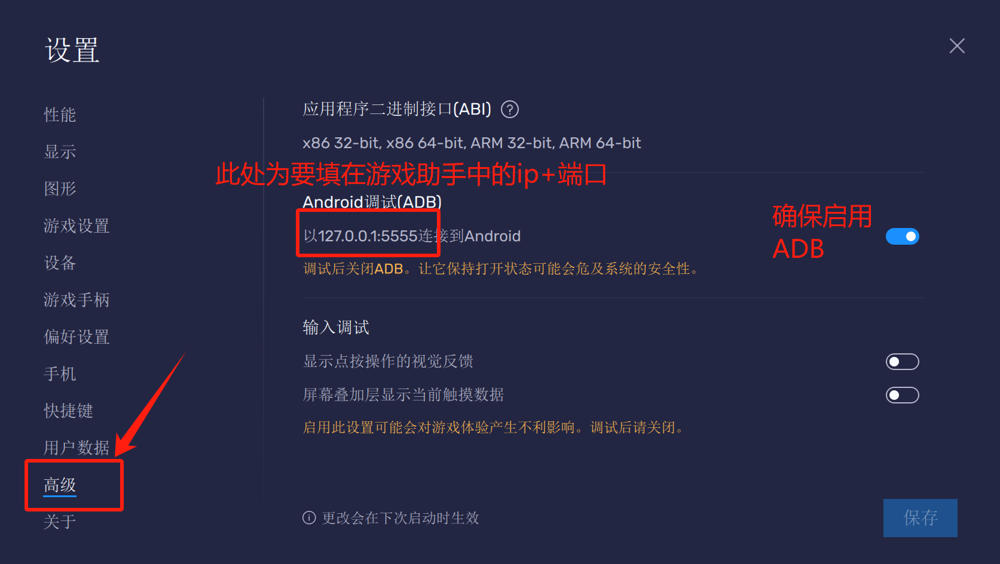
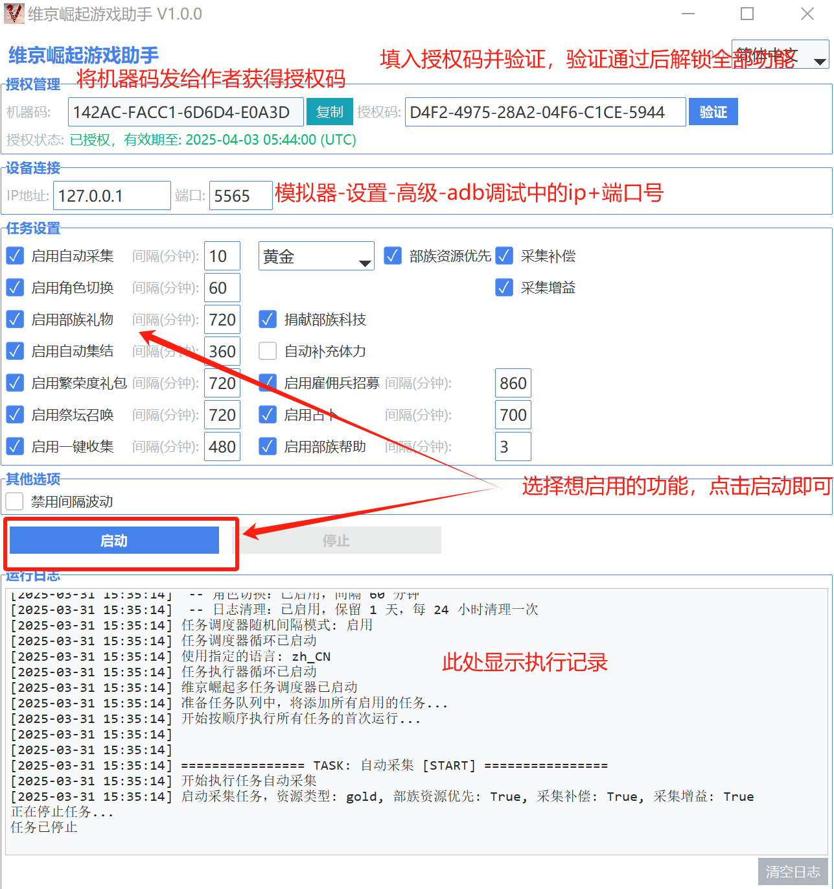

# 维京崛起游戏助手使用说明

## 重要提示

**使用前请仔细阅读本说明文档！**

- **模拟器分辨率必须设置为960x540**
- **强烈推荐使用蓝叠模拟器获得最佳适配效果**

## 软件简介

维京崛起游戏助手是一款专为《维京崛起》游戏设计的辅助工具，旨在帮助普通玩家减少日常重复操作的时间消耗，提高游戏效率。本工具通过自动化完成资源采集、日常任务等基础活动，使玩家能够将更多精力专注于游戏的核心玩法，如战斗策略和部落活动等互动性更强的游戏内容。

**使用目的**：本助手仅供个人游戏体验优化使用，帮助玩家合理分配游戏时间，减轻重复操作的负担。

**重要说明**：下载即可获得基础采集功能，联系作者可获得三天完整版体验权。联系作者：QQ: 690427204, Discord: yuanbao007081

**多语言支持**：本助手支持多种语言界面，包括：
- 中文（简体）- 默认语言
- 中文（繁体）
- 英文（English）
- 俄语（Русский）
您可以在软件界面右上角的语言选择下拉菜单中切换语言。语言切换后，界面和提示信息将立即更新为对应语言。

**说明文档多语言版本**：
- 简体中文版（默认）：README.md
- 繁体中文版：README_zh_TW.md
- 英文版：README_en_US.md
- 俄语版：README_ru_RU.md

## 功能列表

本工具包含以下功能：

1. **自动采集资源**：自动寻找并采集地图上的资源点
   - 可选资源类型：随机、黄金、石头、木材、食物
   - 支持部族资源优先采集
   - 支持采集补偿（采集失败时自动尝试其他资源）
   - 采集前自动开启背包中的采集增益

2. **角色切换**：自动在角色管理页面上方的两个角色之间切换，并执行一次已启用的其他任务

3. **部族礼物**：自动领取部族礼物
   - 可选择是否捐献部族技术

4. **繁荣度礼包**：自动领取繁荣度礼包

5. **祭坛召唤**：自动执行免费祭坛召唤

6. **雇佣兵招募**：自动完成每日雇佣兵招募

7. **占卜加速**：自动进行加速道具的占卜

8. **自动集结**：自动刷新战争大厅的集结功能

9. **城内一键收集**：自动收集城内所有资源

10. **部族帮助**：自动点击右下角部族帮助

## 使用方法

### 基本设置

1. **模拟器设置**：
   - **必须将模拟器分辨率设置为960x540**
   - **强烈推荐使用蓝叠模拟器，以获得最佳适配效果**
   - **推荐设置模拟器为2核心、4G内存配置，以确保助手运行流畅**
   - 确保模拟器连接正常,蓝叠模拟器-设置-高级-Android调试（ADB）查看ip:port,（第一个模拟器实例默认IP: 127.0.0.1，端口: 5555，第二个需自行查看）

2. **授权管理**：
   - **下载即可获得基础采集功能，联系作者可获得三天完整版体验权。**
   - **联系作者：QQ: 690427204, Discord: yuanbao007081**
   - 首次使用时，需要复制机器码并发送给开发者获取授权码
   - 输入授权码后点击"验证"按钮
   - 未授权状态下只能使用基本自动采集功能
   - **每个授权码只能在一台电脑上使用，但不限制该电脑上的多开数量**
   - **如需在其他电脑上使用，请联系作者重新购买授权码**

### 任务设置

1. 在任务设置区域勾选需要执行的任务
2. 为每个任务设置合适的执行间隔时间（分钟）
3. 点击"启动"按钮开始执行任务
4. 任务运行期间可查看日志了解执行情况
5. 需要停止时点击"停止"按钮

## 注意事项

1. **游戏界面要求**：
   - 祭坛、占卜小屋、战争大厅等建筑需在城内中心区域，否则可能无法识别

2. **运行环境**：
   - 使用过程中请勿将模拟器最小化
   - 避免在助手运行时操作模拟器，以免干扰助手运行
   - 建议电脑保持充足电量或接通电源

3. **安全建议**：
   - 建议使用间隔波动功能（默认开启），模拟真人操作习惯
   - 长时间使用后建议适当休息，避免过度沉迷游戏

4. **其他说明**：
   - 软件会自动保存配置，下次启动时自动加载
   - 如遇问题可清空日志后重新运行，查看详细错误信息

## 常见问题

1. **任务无法正常执行**：
   - 检查模拟器分辨率是否设置为960x540
   - 检查模拟器连接是否正常
   - 检查游戏界面是否正常，建筑物是否在视野范围内

2. **授权验证失败**：
   - 确认输入的授权码是否正确
   - 重新获取机器码并联系开发者
   - 请注意：授权码与机器码绑定，无法在多台电脑上使用同一授权码
   - 如需在其他电脑上使用，请联系作者重新购买授权码

3. **助手识别错误**：
   - 确保网络通畅
   - 确保电脑性能足够、并合理设置模拟器核心数、内存，推荐2C4G
   - 调整游戏界面，确保相关建筑在视野中心
   - 尝试重启游戏和助手

## 免责声明

本工具仅供学习、研究和个人游戏体验优化使用，使用本工具产生的一切后果由用户自行承担。请遵守游戏规则和相关法律法规，合理使用本工具。

**使用限制**：
- 严禁将本助手用于任何商业目的，包括但不限于利用助手大量生产游戏资源进行交易
- 禁止使用本助手进行违反游戏规则的行为或获取不正当利益
- 开发者保留对违规使用行为追究法律责任的权利

开发者不对因使用本工具而导致的任何损失负责。

---

© 2025 维京崛起游戏助手 - 保留所有权利

=====================================================================================================================

# 蓝叠模拟器设置

蓝叠模拟器官方下载地址：https://www.bluestacks.com/?&lang=zh-hant

为确保助手能够正常工作，请按照以下步骤设置蓝叠模拟器：

## 1. 进入设置界面

- 在蓝叠模拟器主界面右侧，点击**齿轮图标**（设置按钮）打开设置面板

## 2. 性能设置

- 点击左侧菜单中的**性能**选项
- 将CPU设置为**2核心**（推荐）
- 将内存设置为**4GB**（推荐）
- 点击**保存**按钮应用更改
- 重要提示：如果您的电脑配置较低，可适当降低配置，但可能会影响助手运行效率

## 3. 分辨率设置（必须）

- 点击左侧菜单中的**显示**选项
- 将分辨率设置为**960 x 540**（**必须**设置为此分辨率）
- 选择**横屏**模式
- 点击**保存**按钮应用更改

## 4. ADB调试设置

- 点击左侧菜单中的**高级**选项
- 找到**Android调试(ADB)**部分
- 确保已勾选**启用Android调试(ADB)**选项
- 记录显示的**IP地址和端口号**（通常第一个模拟器实例为127.0.0.1:5555）
  - 请注意：如果您启动了多个蓝叠模拟器实例，每个实例的端口号会不同，需要重新查看
  - 助手连接时需要使用正确的端口号
- 如需在同一台电脑上多开模拟器，请在创建新实例时确保每个实例都设置正确的分辨率

## 5. 验证设置

- 完成上述设置后，重启蓝叠模拟器
- 打开游戏，确认游戏界面显示正常
- 启动维京崛起游戏助手，在连接设置中输入正确的IP地址和端口号

按照以上步骤正确设置模拟器后，助手将能够正常识别游戏界面并执行自动化任务。

=====================================================================================================================

# 游戏助手界面使用说明

## 界面概览

游戏助手界面分为几个主要区域：

- **连接区域**：设置和管理模拟器连接
- **授权区域**：管理软件授权信息
- **任务设置区域**：选择和配置自动化任务
- **运行控制区域**：启动/停止助手和查看运行状态
- **日志区域**：显示助手运行过程中的实时日志

## 快速上手

1. **连接模拟器**：
   - 在连接区域输入模拟器的IP地址和端口号
   - 点击"连接"按钮

2. **授权管理**：
   - 复制机器码并发送给开发者获取授权码
   - 输入授权码后点击"验证"按钮

3. **任务配置**：
   - 勾选需要执行的任务
   - 设置每个任务的执行间隔时间（分钟），无特殊需求使用默认值即可
   - 设置资源采集的偏好选项

4. **运行控制**：
   - 点击"启动"按钮开始执行任务
   - 任务运行中可查看日志了解执行情况
   - 需要停止时点击"停止"按钮

5. **配置保存**：
   - 所有配置会自动保存，下次启动时自动加载

## 界面技巧

- 将鼠标悬停在选项上可查看详细说明
- 通过界面右上角的语言下拉菜单可切换软件界面语言（支持中文简体、中文繁体、英文和俄语）
- 语言切换后所有界面文本和提示信息将立即更新，无需重启软件

=====================================================================================================================

# 游戏助手多开说明

游戏助手支持同时运行多个实例，以便同时操作多个游戏账号。多开数量不受软件限制，但取决于您电脑的硬件配置。

## 多开方法

### 方法一：直接多开

- 直接双击exe文件即可启动新的游戏助手实例
- 每个新实例都需要重新填写对应模拟器实例的端口号
- 注意：此方法下所有实例共享同一套配置

**适用场景**：临时需要多开，或者各模拟器配置差异较小

### 方法二：文件夹隔离（推荐）

- 将游戏助手exe文件复制到不同的文件夹中
- 每个文件夹中的exe将独立保存各自的配置
- 可为每个文件夹命名以区分不同角色或用途

**适用场景**：长期多开，或者各模拟器配置差异较大

## 多开注意事项

1. **硬件要求**：
   - 请确保您的电脑有足够的内存和处理能力
   - 每增加一个实例，建议至少有额外2GB内存空间

2. **模拟器配置**：
   - 每个模拟器实例需要单独设置并记录其端口号
   - 多个蓝叠模拟器实例的端口号各不相同

3. **性能优化**：
   - 如电脑性能有限，建议适当降低模拟器图形设置
   - 可考虑关闭不必要的后台程序释放资源

多开数量请根据您的电脑配置合理设置，避免因资源不足导致游戏或助手运行异常。
