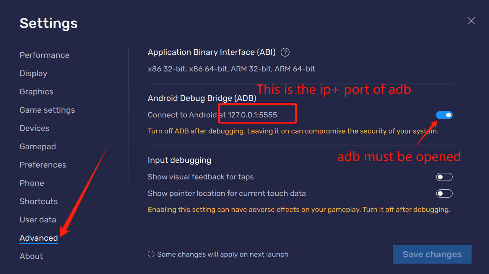
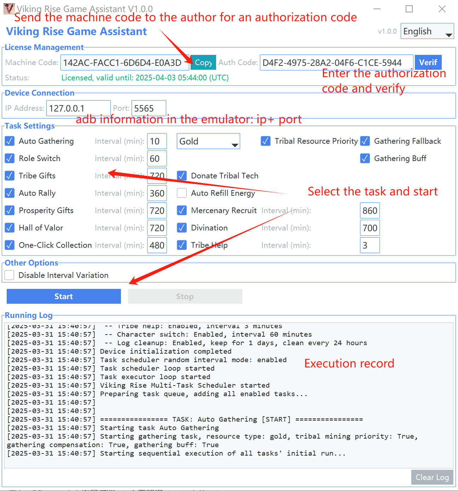

# Viking Rise Game Assistant User Guide

## Important Notes

**Please read this documentation carefully before use!**

- **Emulator resolution must be set to 960x540**
- **BlueStacks emulator is strongly recommended for best compatibility**

## Software Introduction

Viking Rise Game Assistant is a tool designed specifically for the "Viking Rise" game, aimed at helping regular players reduce time spent on repetitive daily operations and improve gaming efficiency. This tool automates resource gathering, daily tasks and other basic activities, allowing players to focus more on core gameplay such as battle strategies and more interactive tribal activities.

**Purpose**: This assistant is for personal gaming experience optimization only, helping players reasonably allocate gaming time and reduce the burden of repetitive operations.

**Important Note**: Basic gathering functionality is available with download. Contact the author for a three-day full version trial. Contact: QQ: 690427204, Discord: yuanbao007081

**Multi-language Support**: This assistant supports multiple interface languages, including:
- English
- Chinese (Simplified)
- Chinese (Traditional)
- Russian (Русский)
You can switch languages using the language selection dropdown in the upper right corner of the software interface. After switching languages, the interface and prompt information will immediately update to the corresponding language.

**Multi-language Documentation**:
- English Version: README_en_US.md
- Simplified Chinese Version (Default): README.md
- Traditional Chinese Version: README_zh_TW.md
- Russian Version: README_ru_RU.md

## Feature List

This tool includes the following features:

1. **Auto Gathering**: Automatically locate and gather resource points on the map
   - Optional resource types: Random, Gold, Stone, Wood, Food
   - Tribal resource priority gathering support
   - Gathering compensation (automatically try other resources when gathering fails)
   - Automatically activate gathering buffs from backpack before gathering

2. **Role Switch**: Automatically switch between the two characters at the top of the character management page and perform one execution of other enabled tasks

3. **Tribe Gifts**: Automatically collect tribe gifts
   - Option to donate to tribal technology

4. **Prosperity Gifts**: Automatically collect prosperity gift packs

5. **Hall of Valor**: Automatically perform free altar summons

6. **Mercenary Recruit**: Automatically complete daily mercenary recruitment

7. **Divination**: Automatically perform divination for acceleration items

8. **Auto Rally**: Automatically refresh the rally function in the War Hall

9. **One-Click Collection**: Automatically collect all resources in the city

10. **Tribe Help**: Automatically click on tribal help in the bottom right

## Usage Instructions

### Basic Setup

1. **Emulator Settings**:
   - **Emulator resolution must be set to 960x540**
   - **BlueStacks emulator is strongly recommended for best compatibility**
   - **Recommended to set the emulator to 2 cores, 4GB memory configuration to ensure smooth assistant operation**
   - Ensure emulator connection is normal. Check IP:port in BlueStacks emulator - Settings - Advanced - Android debugging (ADB) (First emulator instance default IP: 127.0.0.1, port: 5555, check for second instance)

2. **License Management**:
   - **Basic gathering functionality is available with download. Contact the author for a three-day full version trial.**
   - **Contact: QQ: 690427204, Discord: yuanbao007081**
   - For first-time use, copy the machine code and send it to the developer to get authorization code
   - Enter the authorization code and click the "Verify" button
   - Only basic auto-gathering function is available in unlicensed state
   - **Each authorization code can only be used on one computer but allows for multiple instances on that computer**
   - **Contact the author to purchase a new authorization code if you need to use it on another computer**

### Task Settings

1. Check the tasks you want to execute in the task settings area
2. Set appropriate execution interval time (minutes) for each task
3. Click the "Start" button to begin executing tasks
4. Check the log to understand execution status during task running
5. Click the "Stop" button when you need to stop

## Notes

1. **Game Interface Requirements**:
   - Hall of Valor, Divination Hut, War Hall and other buildings need to be in the central area of the city, otherwise they may not be recognized

2. **Running Environment**:
   - Do not minimize the emulator during use
   - Avoid operating the emulator while the assistant is running to prevent interference
   - Keep your computer sufficiently charged or connected to power

3. **Safety Recommendations**:
   - Recommended to use interval variation feature (enabled by default) to simulate real human operation habits
   - Take appropriate breaks after extended use to avoid excessive game immersion

## Common Problems

1. **Tasks Not Executing Properly**:
   - Check if emulator resolution is set to 960x540
   - Check if emulator connection is normal
   - Check if game interface is normal and buildings are within view

2. **Authorization Verification Failed**:
   - Confirm the authorization code entered is correct
   - Obtain the machine code again and contact the developer
   - Note: Authorization code is bound to the machine code and cannot be used on multiple computers
   - Contact the author to purchase a new authorization code if you need to use it on another computer

3. **Assistant Recognition Errors**:
   - Ensure network connection is smooth
   - Ensure computer performance is sufficient and properly set emulator cores and memory, 2C4G recommended
   - Adjust game interface to ensure relevant buildings are in the center of view
   - Try restarting the game and assistant

4. **Auto Gathering**:
   - Ensure network connection is smooth
   - Ensure computer performance is sufficient and properly set emulator cores and memory, 2C4G recommended
   - Adjust game interface to ensure relevant buildings are in the center of view
   - Try restarting the game and assistant

## Disclaimer

This tool is for learning, research, and personal gaming experience optimization only. All consequences arising from the use of this tool are the responsibility of the user. Please comply with game rules and relevant laws and regulations, and use this tool reasonably.

**Usage Restrictions**:
- It is strictly forbidden to use this assistant for any commercial purposes, including but not limited to using the assistant to produce large amounts of game resources for trading
- It is prohibited to use this assistant for behaviors that violate game rules or to obtain improper benefits
- The developer reserves the right to pursue legal responsibility for violations

The developer is not responsible for any loss caused by using this tool.

---

© 2025 Viking Rise Game Assistant - All Rights Reserved

=====================================================================================================================

# BlueStacks Emulator Setup

BlueStacks Emulator Official Download Link: @https://www.bluestacks.com/?&lang=zh-hant

To ensure the assistant works properly, please set up BlueStacks emulator according to the following steps:

## 1. Enter Settings Interface

- Click the **gear icon** (settings button) on the right side of the BlueStacks emulator main interface to open the settings panel

## 2. Performance Settings

- Click on **Performance** in the left menu
- Set CPU to **2 cores** (recommended)
- Set memory to **4GB** (recommended)
- Click the **Save** button to apply changes
- Important note: If your computer configuration is low, you can reduce the configuration appropriately, but it may affect assistant running efficiency

## 3. Resolution Settings (Required)

- Click on **Display** in the left menu
- Set resolution to **960 x 540** (**Must** be set to this resolution)
- Select **Landscape** mode
- Click the **Save** button to apply changes

## 4. ADB Debugging Settings

- Click on **Advanced** in the left menu
- Find the **Android debugging (ADB)** section
- Ensure **Enable Android debugging (ADB)** option is checked
- Note the displayed **IP address and port number** (usually the first emulator instance is 127.0.0.1:5555)
  - Note: If you start multiple BlueStacks emulator instances, each instance will have a different port number, which needs to be checked again
  - The correct port number is required when the assistant connects
- If you need to run multiple emulator instances on the same computer, ensure that each instance has the correct resolution set when creating new instances

## 5. Verify Settings

- Restart BlueStacks emulator after completing the above settings
- Open the game and confirm the game interface displays normally
- Start the Viking Rise Game Assistant and enter the correct IP address and port number in the connection settings

Following the above steps to properly set up the emulator will enable the assistant to recognize the game interface normally and perform automated tasks.

=====================================================================================================================

# Game Assistant Interface Instructions

## Interface Overview

The game assistant interface is divided into several main areas:

- **Connection Area**: Set up and manage emulator connections
- **Authorization Area**: Manage software authorization information
- **Task Settings Area**: Select and configure automated tasks
- **Running Control Area**: Start/stop the assistant and view running status
- **Log Area**: Display real-time logs during assistant operation

## Quick Start

1. **Connect to Emulator**:
   - Enter the emulator's IP address and port number in the connection area
   - Click the "Connect" button

2. **License Management**:
   - Copy the machine code and send it to the developer to get an authorization code
   - Enter the authorization code and click the "Verify" button

3. **Task Configuration**:
   - Check the tasks you want to execute
   - Set the execution interval time (minutes) for each task, use default values if there are no special requirements
   - Set resource gathering preference options

4. **Running Control**:
   - Click the "Start" button to begin executing tasks
   - Check the log to understand execution status during task running
   - Click the "Stop" button when you need to stop

5. **Configuration Saving**:
   - All configurations are automatically saved and loaded on next startup

## Interface Tips

- Hover your mouse over options to view detailed descriptions
- Switch the software interface language through the language dropdown menu in the upper right corner (supports English, Simplified Chinese, Traditional Chinese, and Russian)
- After switching languages, all interface text and prompt messages will update immediately without requiring a software restart

=====================================================================================================================

# Game Assistant Multi-Instance Instructions

The game assistant supports running multiple instances simultaneously to operate multiple game accounts. The number of instances is not limited by the software but depends on your computer's hardware configuration.

## Multi-Instance Methods

### Method One: Direct Multi-Instance

- Simply double-click the exe file to start a new game assistant instance
- Each new instance needs to refill the corresponding emulator instance's port number
- Note: With this method, all instances share the same configuration

**Suitable scenarios**: Temporary need for multiple instances, or when configuration differences between emulators are small

### Method Two: Folder Isolation (Recommended)

- Copy the game assistant exe file to different folders
- The exe in each folder will independently save its own configuration
- Each folder can be named to distinguish different roles or purposes

**Suitable scenarios**: Long-term multiple instances, or when configuration differences between emulators are significant

## Multi-Instance Notes

1. **Hardware Requirements**:
   - Ensure your computer has sufficient memory and processing power
   - For each additional instance, it is recommended to have at least 2GB of extra memory space

2. **Emulator Configuration**:
   - Each emulator instance needs to be set up separately and its port number recorded
   - Port numbers for multiple BlueStacks emulator instances are different from each other 