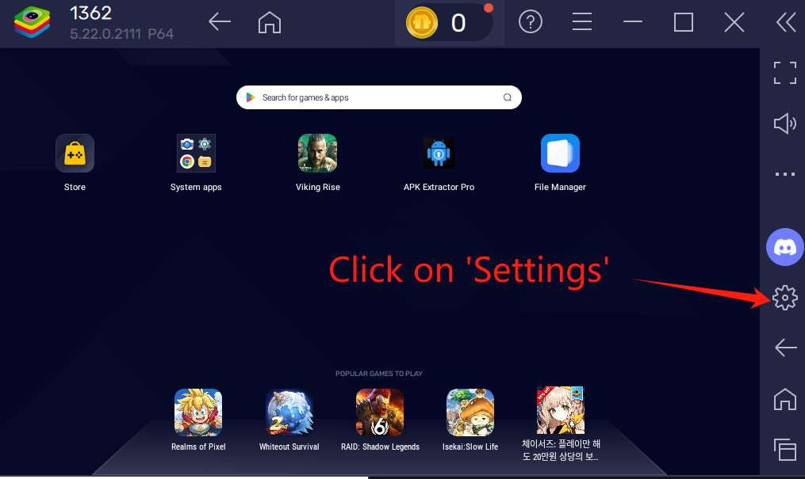
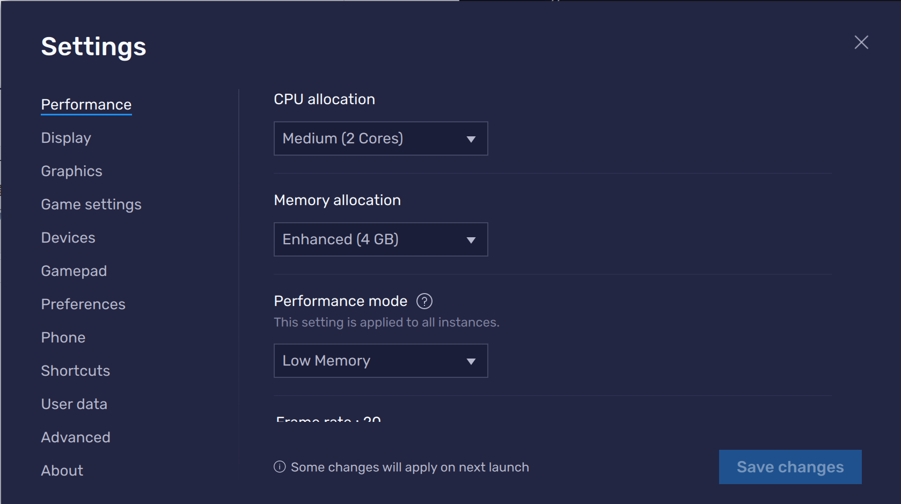
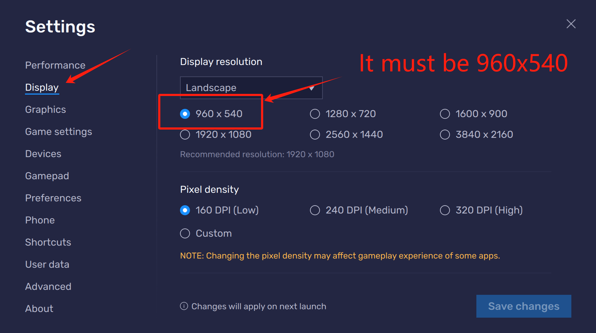
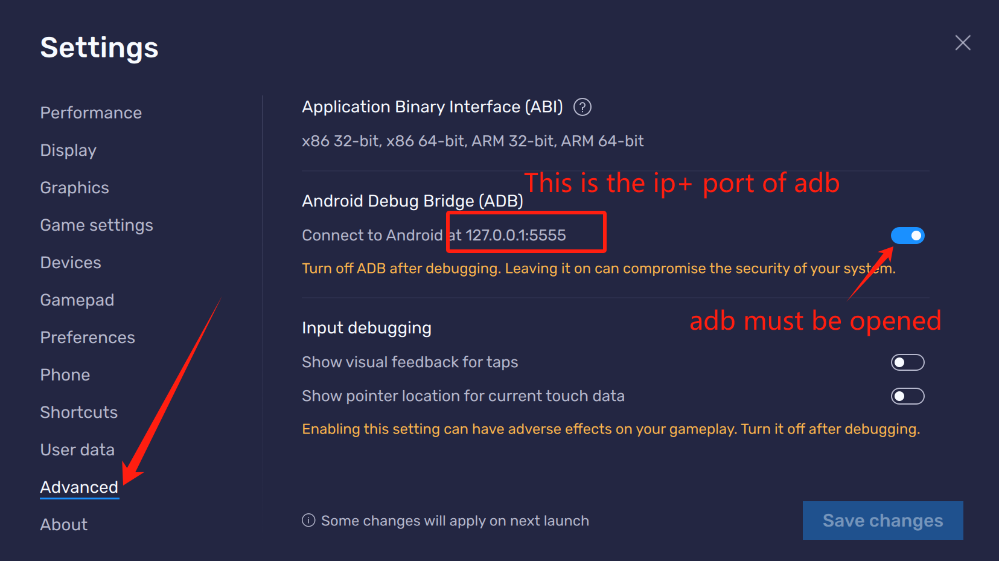
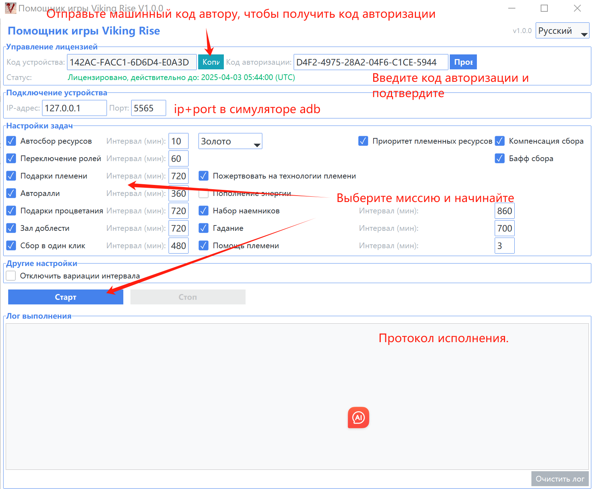

# Помощник игры Viking Rise

## Важные примечания

**Пожалуйста, внимательно прочитайте эту документацию перед использованием!**

- **Разрешение эмулятора должно быть установлено на 960x540**
- **Настоятельно рекомендуется использовать эмулятор BlueStacks для лучшей совместимости**

## Введение в программу

Помощник игры Viking Rise — это инструмент, специально разработанный для игры «Viking Rise», призванный помочь обычным игрокам сократить время, затрачиваемое на повторяющиеся ежедневные операции, и повысить эффективность игрового процесса. Этот инструмент автоматизирует сбор ресурсов, ежедневные задания и другие базовые действия, позволяя игрокам сосредоточиться на основных аспектах игры, таких как боевые стратегии и более интерактивные племенные активности.

**Назначение**: Этот помощник предназначен только для оптимизации личного игрового опыта, помогая игрокам рационально распределять игровое время и уменьшать бремя повторяющихся операций.

**Важное примечание**: Базовая функциональность сбора доступна при загрузке. Свяжитесь с автором для получения трехдневной пробной версии полной версии. Контакт: QQ: 690427204, Discord: yuanbao007081

**Поддержка нескольких языков**: Этот помощник поддерживает несколько языков интерфейса, включая:
- Русский
- Китайский (упрощенный)
- Китайский (традиционный)
- Английский (English)
Вы можете переключать языки с помощью выпадающего меню выбора языка в правом верхнем углу интерфейса программы. После переключения языка интерфейс и информационные сообщения будут сразу обновлены на соответствующий язык.

**Многоязычная документация**:
- Русская версия: README_ru_RU.md
- Версия на упрощенном китайском (по умолчанию): README.md
- Версия на традиционном китайском: README_zh_TW.md
- Английская версия: README_en_US.md

## Список функций

Этот инструмент включает следующие функции:

1. **Автосбор ресурсов**: Автоматически находит и собирает точки ресурсов на карте
   - Дополнительные типы ресурсов: Случайный, Золото, Камень, Дерево, Еда
   - Поддержка приоритета сбора племенных ресурсов
   - Компенсация сбора (автоматический сбор других ресурсов при неудачном сборе)
   - Автоматическая активация бафов сбора из рюкзака перед сбором

2. **Переключение ролей**: Автоматическое переключение между двумя персонажами вверху страницы управления персонажами и выполнение других включенных задач один раз

3. **Подарки племени**: Автоматический сбор подарков племени
   - Возможность пожертвовать на технологии племени

4. **Подарки процветания**: Автоматический сбор подарков процветания

5. **Зал доблести**: Автоматическое выполнение бесплатных призывов на алтаре

6. **Набор наемников**: Автоматическое завершение ежедневного набора наемников

7. **Гадание**: Автоматическое выполнение гадания для предметов ускорения

8. **Авторалли**: Автоматическое обновление функции ралли в Военном зале

9. **Сбор в один клик**: Автоматический сбор всех ресурсов в городе

10. **Помощь племени**: Автоматический клик на помощь племени в правом нижнем углу

## Инструкции по использованию

### Базовая настройка

1. **Настройки эмулятора**:
   - **Разрешение эмулятора должно быть установлено на 960x540**
   - **Настоятельно рекомендуется использовать эмулятор BlueStacks для лучшей совместимости**
   - **Рекомендуется установить конфигурацию эмулятора на 2 ядра, 4 ГБ памяти для обеспечения плавной работы помощника**
   - Убедитесь, что подключение эмулятора нормальное. Проверьте IP:порт в эмуляторе BlueStacks - Настройки - Расширенные - Отладка Android (ADB) (IP первого экземпляра эмулятора по умолчанию: 127.0.0.1, порт: 5555, для второго проверьте самостоятельно)

2. **Управление лицензией**:
   - **Базовая функциональность сбора доступна при загрузке. Свяжитесь с автором для получения трехдневной пробной версии полной версии.**
   - **Контакт: QQ: 690427204, Discord: yuanbao007081**
   - При первом использовании скопируйте код устройства и отправьте его разработчику для получения кода авторизации
   - Введите код авторизации и нажмите кнопку "Проверить"
   - В нелицензионном состоянии доступна только функция автосбора
   - **Каждый код авторизации может использоваться только на одном компьютере, но не ограничивает количество экземпляров на этом компьютере**
   - **Если вам нужно использовать его на другом компьютере, пожалуйста, свяжитесь с автором для приобретения нового кода авторизации**

### Настройки задач

1. Отметьте задачи, которые вы хотите выполнить, в области настроек задач
2. Установите подходящее время интервала выполнения (минуты) для каждой задачи
3. Нажмите кнопку "Старт", чтобы начать выполнение задач
4. Проверьте журнал, чтобы понять статус выполнения во время выполнения задач
5. Нажмите кнопку "Стоп", когда вам нужно остановиться

## Примечания

1. **Требования к игровому интерфейсу**:
   - Алтарь, хижина гадания, Военный зал и другие здания должны находиться в центральной области города, иначе они могут быть не распознаны

2. **Рабочая среда**:
   - Не сворачивайте эмулятор во время использования
   - Избегайте управления эмулятором во время работы помощника, чтобы предотвратить помехи
   - Рекомендуется поддерживать достаточный заряд компьютера или подключать его к источнику питания

3. **Рекомендации по безопасности**:
   - Рекомендуется использовать функцию вариации интервала (включена по умолчанию) для имитации привычек реальной работы человека
   - После длительного использования рекомендуется делать соответствующие перерывы, чтобы избежать чрезмерного погружения в игру

## Распространенные проблемы

1. **Задачи не выполняются должным образом**:
   - Проверьте, установлено ли разрешение эмулятора на 960x540
   - Проверьте, нормально ли подключение эмулятора
   - Проверьте, нормален ли игровой интерфейс, и находятся ли здания в поле зрения

2. **Ошибка проверки авторизации**:
   - Подтвердите правильность введенного кода авторизации
   - Получите код устройства заново и свяжитесь с разработчиком
   - Обратите внимание: код авторизации привязан к коду устройства и не может использоваться на нескольких компьютерах
   - Если вам нужно использовать его на другом компьютере, пожалуйста, свяжитесь с автором для приобретения нового кода авторизации

3. **Ошибки распознавания помощника**:
   - Убедитесь, что сетевое соединение стабильно
   - Убедитесь, что производительности компьютера достаточно, и правильно настройте количество ядер и объем памяти эмулятора, рекомендуется 2Я4Г
   - Настройте игровой интерфейс так, чтобы соответствующие здания находились в центре обзора
   - Попробуйте перезапустить игру и помощника

4. **Автосбор**:
   - Убедитесь, что сетевое соединение стабильно
   - Убедитесь, что производительности компьютера достаточно, и правильно настройте количество ядер и объем памяти эмулятора, рекомендуется 2Я4Г
   - Настройте игровой интерфейс так, чтобы соответствующие здания находились в центре обзора
   - Попробуйте перезапустить игру и помощника

## Отказ от ответственности

Этот инструмент предназначен только для обучения, исследования и оптимизации личного игрового опыта. Пользователь несет ответственность за все последствия, возникающие в результате использования этого инструмента. Пожалуйста, соблюдайте правила игры и соответствующие законы и нормативные акты, и используйте этот инструмент разумно.

**Ограничения использования**:
- Строго запрещается использовать этого помощника в любых коммерческих целях, включая, но не ограничиваясь, использование помощника для производства большого количества игровых ресурсов для торговли
- Запрещается использовать этого помощника для поведения, нарушающего правила игры, или для получения ненадлежащих преимуществ
- Разработчик оставляет за собой право преследовать по закону за нарушения

Разработчик не несет ответственности за любые убытки, вызванные использованием этого инструмента.

---

© 2025 Помощник игры Viking Rise - Все права защищены

=====================================================================================================================

# Настройка эмулятора BlueStacks

Официальная ссылка для скачивания эмулятора BlueStacks: @https://www.bluestacks.com/?&lang=zh-hant

Чтобы помощник работал правильно, настройте эмулятор BlueStacks согласно следующим шагам:

## 1. Войдите в интерфейс настроек

- Нажмите на **значок шестеренки** (кнопка настроек) в правой части главного интерфейса эмулятора BlueStacks, чтобы открыть панель настроек

## 2. Настройки производительности

- Нажмите на **Производительность** в левом меню
- Установите процессор на **2 ядра** (рекомендуется)
- Установите память на **4 ГБ** (рекомендуется)
- Нажмите кнопку **Сохранить**, чтобы применить изменения
- Важное примечание: Если конфигурация вашего компьютера низкая, вы можете соответствующим образом уменьшить конфигурацию, но это может повлиять на эффективность работы помощника

## 3. Настройки разрешения (обязательно)

- Нажмите на **Дисплей** в левом меню
- Установите разрешение на **960 x 540** (**Должно** быть установлено на это разрешение)
- Выберите режим **Ландшафт**
- Нажмите кнопку **Сохранить**, чтобы применить изменения

## 4. Настройки отладки ADB

- Нажмите на **Расширенные** в левом меню
- Найдите раздел **Отладка Android (ADB)**
- Убедитесь, что опция **Включить отладку Android (ADB)** отмечена
- Запишите отображаемые **IP-адрес и номер порта** (обычно первый экземпляр эмулятора - 127.0.0.1:5555)
  - Примечание: Если вы запустили несколько экземпляров эмулятора BlueStacks, каждый экземпляр будет иметь разный номер порта, который нужно проверить заново
  - Правильный номер порта требуется, когда помощник подключается
- Если вам нужно запустить несколько экземпляров эмулятора на одном компьютере, убедитесь, что каждый экземпляр имеет правильное разрешение при создании новых экземпляров

## 5. Проверьте настройки

- Перезапустите эмулятор BlueStacks после завершения настроек
- Откройте игру и убедитесь, что игровой интерфейс отображается нормально
- Запустите помощника игры Viking Rise и введите правильный IP-адрес и номер порта в настройках подключения

Следуя вышеуказанным шагам для правильной настройки эмулятора, помощник сможет нормально распознавать игровой интерфейс и выполнять автоматизированные задачи.

=====================================================================================================================

# Инструкции по интерфейсу помощника игры

## Обзор интерфейса

Интерфейс помощника игры разделен на несколько основных областей:

- **Область подключения**: Настройка и управление подключениями эмулятора
- **Область авторизации**: Управление информацией об авторизации программы
- **Область настроек задач**: Выбор и настройка автоматизированных задач
- **Область управления выполнением**: Запуск/остановка помощника и просмотр статуса выполнения
- **Область журнала**: Отображение журналов в реальном времени во время работы помощника

## Быстрый старт

1. **Подключение к эмулятору**:
   - Введите IP-адрес и номер порта эмулятора в области подключения
   - Нажмите кнопку "Подключиться"

2. **Управление лицензией**:
   - Скопируйте код устройства и отправьте его разработчику для получения кода авторизации
   - Введите код авторизации и нажмите кнопку "Проверить"

3. **Настройка задач**:
   - Отметьте задачи, которые вы хотите выполнить
   - Установите время интервала выполнения (минуты) для каждой задачи, используйте значения по умолчанию, если нет особых требований
   - Установите параметры предпочтений для сбора ресурсов

4. **Управление выполнением**:
   - Нажмите кнопку "Старт", чтобы начать выполнение задач
   - Проверьте журнал, чтобы понять статус выполнения во время выполнения задач
   - Нажмите кнопку "Стоп", когда вам нужно остановиться

5. **Сохранение настроек**:
   - Все настройки автоматически сохраняются и загружаются при следующем запуске

## Советы по интерфейсу

- Наведите указатель мыши на опции, чтобы просмотреть подробные описания
- Переключайте язык интерфейса программы через выпадающее меню языков в правом верхнем углу (поддерживаются русский, упрощенный китайский, традиционный китайский и английский языки)
- После переключения языка весь текст интерфейса и информационные сообщения обновятся немедленно без необходимости перезапуска программы

=====================================================================================================================

# Инструкции по использованию нескольких экземпляров помощника игры

Помощник игры поддерживает одновременный запуск нескольких экземпляров для управления несколькими игровыми аккаунтами. Количество экземпляров не ограничено программой, но зависит от аппаратной конфигурации вашего компьютера.

## Методы использования нескольких экземпляров

### Метод один: Прямой запуск нескольких экземпляров

- Просто дважды щелкните на exe-файл, чтобы запустить новый экземпляр помощника игры
- Каждый новый экземпляр требует повторного заполнения номера порта соответствующего экземпляра эмулятора
- Примечание: При этом методе все экземпляры используют одну и ту же конфигурацию

**Подходящие сценарии**: Временная необходимость в нескольких экземплярах или когда различия в конфигурации эмуляторов невелики

### Метод два: Изоляция папок (рекомендуется)

- Скопируйте exe-файл помощника игры в разные папки
- Exe-файл в каждой папке будет независимо сохранять свою собственную конфигурацию
- Каждую папку можно назвать для различения разных ролей или назначений

**Подходящие сценарии**: Долгосрочное использование нескольких экземпляров или когда различия в конфигурации эмуляторов значительны

## Примечания по использованию нескольких экземпляров

1. **Требования к оборудованию**:
   - Убедитесь, что ваш компьютер имеет достаточно памяти и вычислительной мощности
   - Для каждого дополнительного экземпляра рекомендуется иметь минимум 2 ГБ дополнительного пространства памяти

2. **Конфигурация эмулятора**:
   - Каждый экземпляр эмулятора нужно настроить отдельно и записать его номер порта
   - Номера портов для нескольких экземпляров эмулятора BlueStacks отличаются друг от друга 