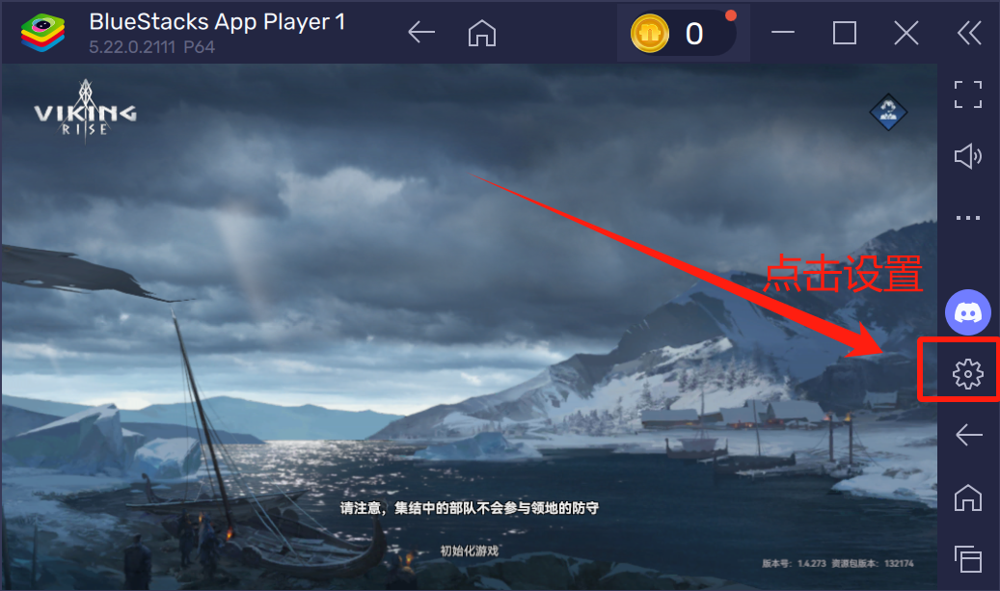
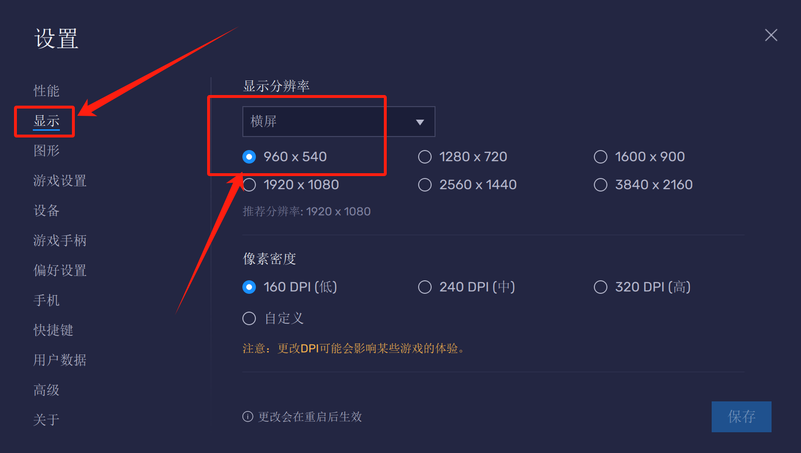

# 維京崛起遊戲助手使用說明

## 重要提示

**使用前請仔細閱讀本說明文檔！**

- **模擬器解析度必須設置為960x540**
- **強烈推薦使用藍疊模擬器獲得最佳適配效果**

## 軟件簡介

維京崛起遊戲助手是一款專為《維京崛起》遊戲設計的輔助工具，旨在幫助普通玩家減少日常重複操作的時間消耗，提高遊戲效率。本工具通過自動化完成資源採集、日常任務等基礎活動，使玩家能夠將更多精力專注於遊戲的核心玩法，如戰鬥策略和部落活動等互動性更強的遊戲內容。

**使用目的**：本助手僅供個人遊戲體驗優化使用，幫助玩家合理分配遊戲時間，減輕重複操作的負擔。

**重要說明**：下載即可獲得基礎採集功能，聯繫作者可獲得三天完整版體驗權。聯繫作者：QQ: 690427204, Discord: yuanbao007081

**多語言支持**：本助手支持多種語言界面，包括：
- 中文（繁體）
- 中文（簡體）
- 英文（English）
- 俄語（Русский）
您可以在軟件界面右上角的語言選擇下拉菜單中切換語言。語言切換後，界面和提示信息將立即更新為對應語言。

**說明文檔多語言版本**：
- 繁體中文版：README_zh_TW.md
- 簡體中文版（默認）：README.md
- 英文版：README_en_US.md
- 俄語版：README_ru_RU.md

## 功能列表

本工具包含以下功能：

1. **自動採集資源**：自動尋找並採集地圖上的資源點
   - 可選資源類型：隨機、黃金、石頭、木材、食物
   - 支持部族資源優先採集
   - 支持採集補償（採集失敗時自動嘗試其他資源）
   - 採集前自動開啟背包中的採集增益

2. **角色切換**：自動在角色管理頁面上方的兩個角色之間切換，並執行一次已啟用的其他任務

3. **部族禮物**：自動領取部族禮物
   - 可選擇是否捐獻部族技術

4. **繁榮度禮包**：自動領取繁榮度禮包

5. **祭壇召喚**：自動執行免費祭壇召喚

6. **雇傭兵招募**：自動完成每日雇傭兵招募

7. **占卜加速**：自動進行加速道具的占卜

8. **自動集結**：自動刷新戰爭大廳的集結功能

9. **城內一鍵收集**：自動收集城內所有資源

10. **部族幫助**：自動點擊右下角部族幫助

## 使用方法

### 基本設置

1. **模擬器設置**：
   - **必須將模擬器解析度設置為960x540**
   - **強烈推薦使用藍疊模擬器，以獲得最佳適配效果**
   - **推薦設置模擬器為2核心、4G內存配置，以確保助手運行流暢**
   - 確保模擬器連接正常,藍疊模擬器-設置-高級-Android調試（ADB）查看ip:port,（第一個模擬器實例默認IP: 127.0.0.1，端口: 5555，第二個需自行查看）

2. **授權管理**：
   - **下載即可獲得基礎採集功能，聯繫作者可獲得三天完整版體驗權。**
   - **聯繫作者：QQ: 690427204, Discord: yuanbao007081**
   - 首次使用時，需要複製機器碼並發送給開發者獲取授權碼
   - 輸入授權碼後點擊"驗證"按鈕
   - 未授權狀態下只能使用基本自動採集功能
   - **每個授權碼只能在一台電腦上使用，但不限制該電腦上的多開數量**
   - **如需在其他電腦上使用，請聯繫作者重新購買授權碼**

### 任務設置

1. 在任務設置區域勾選需要執行的任務
2. 為每個任務設置合適的執行間隔時間（分鐘）
3. 點擊"啟動"按鈕開始執行任務
4. 任務運行期間可查看日誌了解執行情況
5. 需要停止時點擊"停止"按鈕

## 注意事項

1. **遊戲界面要求**：
   - 祭壇、占卜小屋、戰爭大廳等建築需在城內中心區域，否則可能無法識別

2. **運行環境**：
   - 使用過程中請勿將模擬器最小化
   - 避免在助手運行時操作模擬器，以免干擾助手運行
   - 建議電腦保持充足電量或接通電源

3. **安全建議**：
   - 建議使用間隔波動功能（默認開啟），模擬真人操作習慣
   - 長時間使用後建議適當休息，避免過度沉迷遊戲

4. **其他說明**：
   - 軟件會自動保存配置，下次啟動時自動加載
   - 如遇問題可清空日誌後重新運行，查看詳細錯誤信息

## 常見問題

1. **任務無法正常執行**：
   - 檢查模擬器解析度是否設置為960x540
   - 檢查模擬器連接是否正常
   - 檢查遊戲界面是否正常，建築物是否在視野範圍內

2. **授權驗證失敗**：
   - 確認輸入的授權碼是否正確
   - 重新獲取機器碼並聯繫開發者
   - 請注意：授權碼與機器碼綁定，無法在多台電腦上使用同一授權碼
   - 如需在其他電腦上使用，請聯繫作者重新購買授權碼

3. **助手識別錯誤**：
   - 確保網絡暢通
   - 確保電腦性能足夠、並合理設置模擬器核心數、內存，推薦2C4G
   - 調整遊戲界面，確保相關建築在視野中心
   - 嘗試重啟遊戲和助手

## 免責聲明

本工具僅供學習、研究和個人遊戲體驗優化使用，使用本工具產生的一切後果由用戶自行承擔。請遵守遊戲規則和相關法律法規，合理使用本工具。

**使用限制**：
- 嚴禁將本助手用於任何商業目的，包括但不限於利用助手大量生產遊戲資源進行交易
- 禁止使用本助手進行違反遊戲規則的行為或獲取不正當利益
- 開發者保留對違規使用行為追究法律責任的權利

開發者不對因使用本工具而導致的任何損失負責。

---

© 2025 維京崛起遊戲助手 - 保留所有權利

=====================================================================================================================

# 藍疊模擬器設置

藍疊模擬器官方下載地址：@https://www.bluestacks.com/?&lang=zh-hant

為確保助手能夠正常工作，請按照以下步驟設置藍疊模擬器：

## 1. 進入設置界面

- 在藍疊模擬器主界面右側，點擊**齒輪圖標**（設置按鈕）打開設置面板

## 2. 性能設置

- 點擊左側菜單中的**性能**選項
- 將CPU設置為**2核心**（推薦）
- 將內存設置為**4GB**（推薦）
- 點擊**保存**按鈕應用更改
- 重要提示：如果您的電腦配置較低，可適當降低配置，但可能會影響助手運行效率

## 3. 解析度設置（必須）

- 點擊左側菜單中的**顯示**選項
- 將解析度設置為**960 x 540**（**必須**設置為此解析度）
- 選擇**橫屏**模式
- 點擊**保存**按鈕應用更改

## 4. ADB調試設置

- 點擊左側菜單中的**高級**選項
- 找到**Android調試(ADB)**部分
- 確保已勾選**啟用Android調試(ADB)**選項
- 記錄顯示的**IP地址和端口號**（通常第一個模擬器實例為127.0.0.1:5555）
  - 請注意：如果您啟動了多個藍疊模擬器實例，每個實例的端口號會不同，需要重新查看
  - 助手連接時需要使用正確的端口號
- 如需在同一台電腦上多開模擬器，請在創建新實例時確保每個實例都設置正確的解析度

## 5. 驗證設置

- 完成上述設置後，重啟藍疊模擬器
- 打開遊戲，確認遊戲界面顯示正常
- 啟動維京崛起遊戲助手，在連接設置中輸入正確的IP地址和端口號

按照以上步驟正確設置模擬器後，助手將能夠正常識別遊戲界面並執行自動化任務。

=====================================================================================================================

# 遊戲助手界面使用說明

## 界面概覽

遊戲助手界面分為幾個主要區域：

- **連接區域**：設置和管理模擬器連接
- **授權區域**：管理軟件授權信息
- **任務設置區域**：選擇和配置自動化任務
- **運行控制區域**：啟動/停止助手和查看運行狀態
- **日誌區域**：顯示助手運行過程中的實時日誌

## 快速上手

1. **連接模擬器**：
   - 在連接區域輸入模擬器的IP地址和端口號
   - 點擊"連接"按鈕

2. **授權管理**：
   - 複製機器碼並發送給開發者獲取授權碼
   - 輸入授權碼後點擊"驗證"按鈕

3. **任務配置**：
   - 勾選需要執行的任務
   - 設置每個任務的執行間隔時間（分鐘），無特殊需求使用默認值即可
   - 設置資源採集的偏好選項

4. **運行控制**：
   - 點擊"啟動"按鈕開始執行任務
   - 任務運行中可查看日誌了解執行情況
   - 需要停止時點擊"停止"按鈕

5. **配置保存**：
   - 所有配置會自動保存，下次啟動時自動加載

## 界面技巧

- 將鼠標懸停在選項上可查看詳細說明
- 通過界面右上角的語言下拉菜單可切換軟件界面語言（支持中文繁體、中文簡體、英文和俄語）
- 語言切換後所有界面文本和提示信息將立即更新，無需重啟軟件

=====================================================================================================================

# 遊戲助手多開說明

遊戲助手支持同時運行多個實例，以便同時操作多個遊戲賬號。多開數量不受軟件限制，但取決於您電腦的硬件配置。

## 多開方法

### 方法一：直接多開

- 直接雙擊exe文件即可啟動新的遊戲助手實例
- 每個新實例都需要重新填寫對應模擬器實例的端口號
- 注意：此方法下所有實例共享同一套配置

**適用場景**：臨時需要多開，或者各模擬器配置差異較小

### 方法二：文件夾隔離（推薦）

- 將遊戲助手exe文件複製到不同的文件夾中
- 每個文件夾中的exe將獨立保存各自的配置
- 可為每個文件夾命名以區分不同角色或用途

**適用場景**：長期多開，或者各模擬器配置差異較大

## 多開注意事項

1. **硬件要求**：
   - 請確保您的電腦有足夠的內存和處理能力
   - 每增加一個實例，建議至少有額外2GB內存空間

2. **模擬器配置**：
   - 每個模擬器實例需要單獨設置並記錄其端口號
   - 多個藍疊模擬器實例的端口號各不相同 